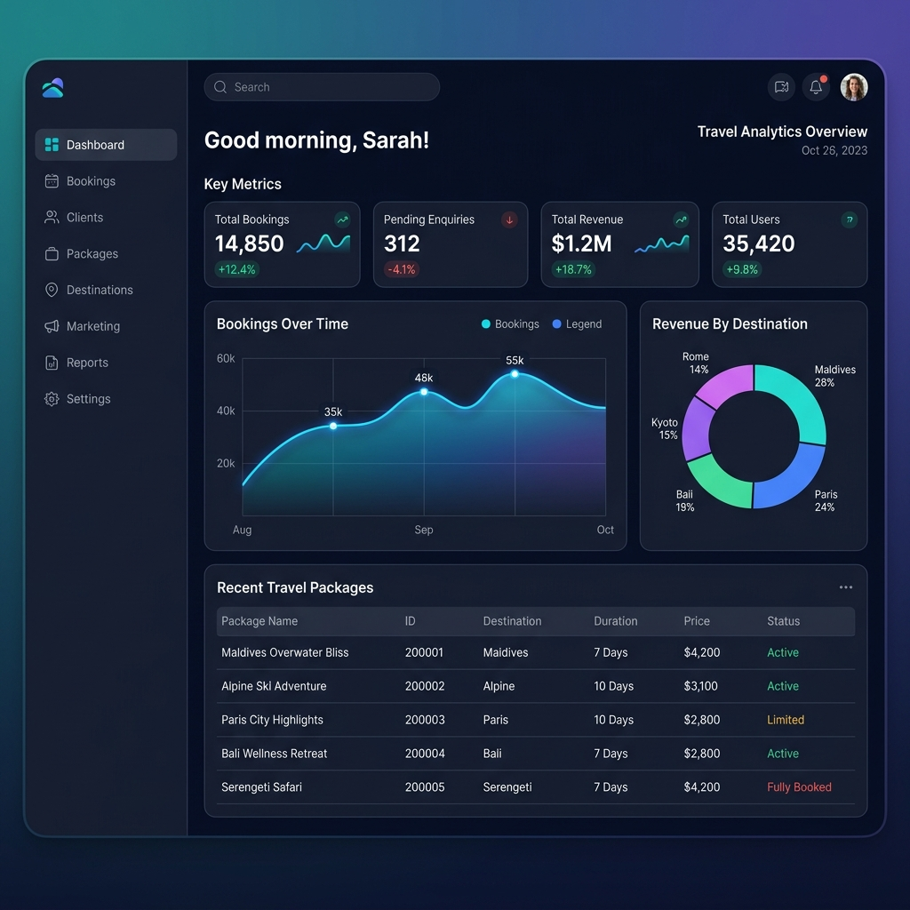
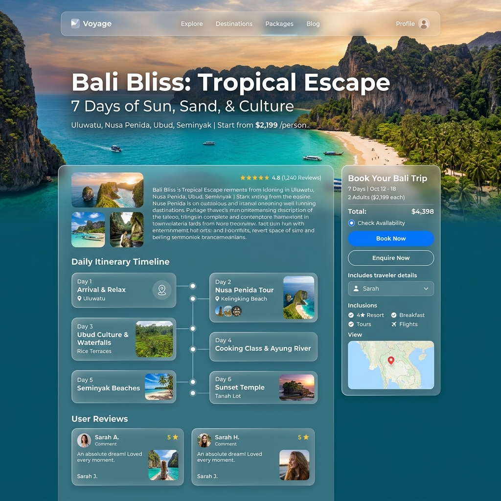

# 🌍 Travel Management System

A high-performance, responsive **PHP & MySQL** based Travel Management System built to streamline holiday bookings, package administration, and customer enquiries. Styled beautifully using **Bootstrap** for a modern, sleek user experience.

---

## 🎨 User Interface Showcase

### 🏠 Home Page


### 📊 Administrative Dashboard


### ✈️ Booking & Enquiries


---

## 👤 Developer Information

* **Author:** **Vijay Mahes**
* **Email:** [Vijaypradhap2004@gmail.com](mailto:Vijaypradhap2004@gmail.com)
* **GitHub Repository:** [Travel-Management-System-php](https://github.com/vijaymahes9080/Travel-Management-System-php.git)

---

## ⚡ Core Features

- **Interactive UI & Slides:** Gorgeous sliders showcasing primary tourist spots, custom pricing, and rating metrics.
- **Dynamic Filtering:** Navigate through diverse categories and subcategories instantly.
- **Hassle-Free Booking:** Seamless enquiry submission and real-time booking form validation.
- **Powerful Admin Console:**
  - View, approve, or manage travel enquiries.
  - Create, modify, and delete tour packages, categories, and subcategories.
  - Oversee and administer system users.

---

## 🛠️ Tech Stack & Requirements

| Layer | Technology |
|---|---|
| **Backend** | PHP 7.4+ |
| **Database** | MySQL / MariaDB |
| **Frontend Styling** | HTML5, CSS3, Bootstrap 3, Google Fonts |
| **Interactivity** | JavaScript, jQuery |

---

## 🚀 Quick Setup & Installation

1. **Clone the Repository:**
   ```bash
   git clone https://github.com/vijaymahes9080/Travel-Management-System-php.git
   ```
2. **Move to Server Directory:** Place the project folder in your local server directory (e.g., `htdocs` for XAMPP or `www` for WAMP).
3. **Database Import:**
   - Open **phpMyAdmin**.
   - Create a database named `travel`.
   - Import the database file: `database/travel.sql`.
4. **Configure Connections:** Update database credentials in the `function.php` files (both under the root directory and the `Admin` directory) if necessary.
5. **Run the Application:**
   - Frontend: `http://localhost/travel/index.php`
   - Admin Panel: `http://localhost/travel/Admin/loginform.php`

---

## 📄 License
This project is licensed under the MIT License - see the [LICENSE](LICENSE) file for details.
